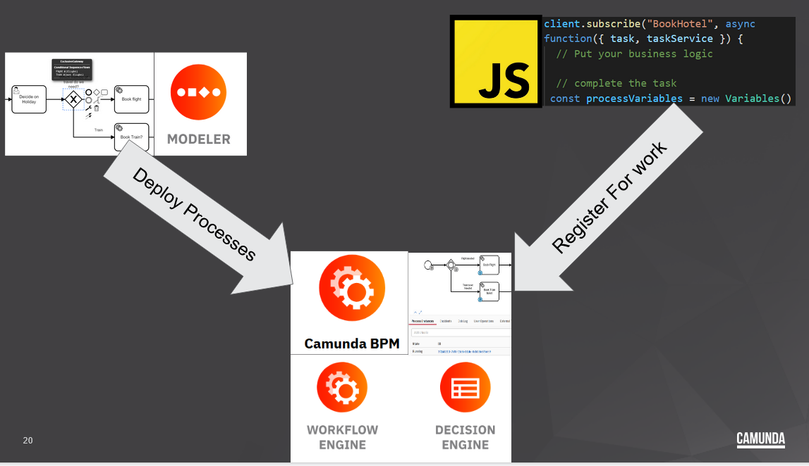
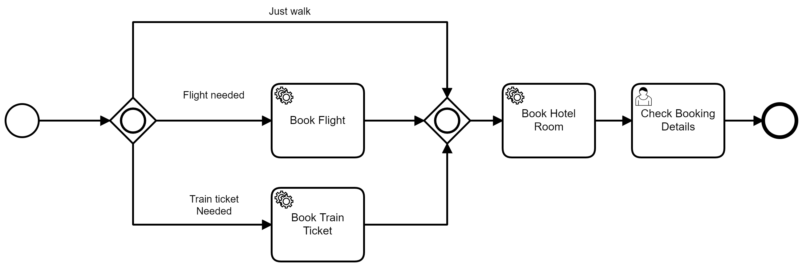
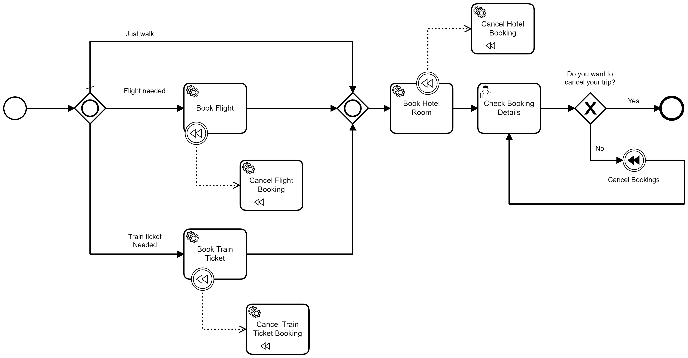
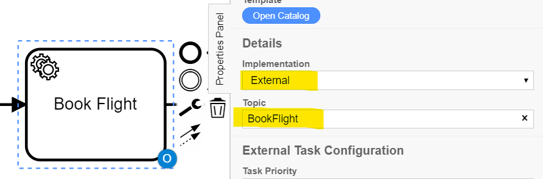

# Camunda Saga Pattern Example

This is an example of how to model the Saga partter by taking a distributed group of microservices and have them orchestrated asyncronousely using Camunda and BPMN. 

It involves 3 groups of independend components. 
1. The Camunda Platform Run
1. A BPMN model created by the Camunda Modeler
1. JavaScript Microservice Workers

Camunda Run is at the center of everything. The modeles are deployed to it and the services are resigster for work to it.



## Understanding the Components

## The Camunda Platform Run
This is a Spring Boot application that contains the Camunda Engine, The Camunda Webapps and The REST API.

You can deploy processes to it via the modeler, start process instance, administrate them and step through them as an end user.

## The BPMN Process Models
There are two process modeles in this repo. The first shows how a series of services and be used to book a holiday.



The second model has the same hotel booking feature, with the addtion of being able to reverse the actions made based on the user's choice.



The importand addtion is the use of compensation in the process. A `Compensation Throw Event` is thrown and any task that had been previously completed and has a `Compensation Catch Event`attached to it will running the `Compensation Task`linked to it. Thus implementing the Saga Pattern.

You can find out more details about [compensation and BPMN in the docs.](https://docs.camunda.org/manual/7.14/reference/bpmn20/events/cancel-and-compensation-events/#compensation-events) 

## The External Task Workers (Microservices)
These are independent services written in java script which subscripe to the Camunda Patform for a `Topic`. The services will then be given any work for that topic. It works be defining the topic as part of the model and then having the worker subscripte to the topic of the same name. 

The model semandics are descriped as follows:


The Worker then needs to subscribe to the same topic - In this case it's `BookFlight`
```JavaScript
// susbscribe to the topic: 'BookFlight'
client.subscribe("BookFlight", async function({ task, taskService }) { 
  // Put your business logic
  await new Promise(r => setTimeout(r, 2000));
  // complete the task

 // Create variables to be returned to the process
 const processVariables = new Variables();
  processVariables.set("FlightBookingStatus", "Confirmed");
  processVariables.set("FlightBookingID", create_UUID());
// Complete the task
  await taskService.complete(task, processVariables);
});
```

Workers can often subscribe to more than one topic, especially in the case where the work falls into the same context or responsibility. In this example the worker responsible for making a booking is also responsibile for canceling a booking. So the worker has a second subscription.

```JavaScript
// susbscribe to the topic: 'CancelFlightBooking'
client.subscribe("CancelFlightBooking", async function({ task, taskService }) {
  // Just a little sleep method to show that some work is doing done
  await new Promise(r => setTimeout(r, 2000));
  // create variables to be sent back
  const processVariables = new Variables();
  processVariables.set("FlightBookingStatus", "Canceled");
  // complete task
  await taskService.complete(task, processVariables);
});
```

## Installation
As I mentioned there are three components and each needing to be installed (but it's all pretty easy)

### Intalling Camunda Platform Run 

You can choose here to either follow the instructions to [intall Camunda Platform Run ](https://docs.camunda.org/manual/latest/installation/camunda-bpm-run/)  on the docs page **OR** You can start is up using docker
 with the following command
```sh
docker pull camunda/camunda-bpm-platform:run-latest
docker run -d --name camunda -p 8080:8080 camunda/camunda-bpm-platform:run-latest 
```
### Deploying the process Modeles
The process models are part of this repo in the ``./Models/`` folder. You deploy them by downloading the [Camunda Modeler](https://camunda.com/download/modeler/), opening them up and useing the depoly button. if successful, you should see them in Camunda cockpit.


### Installing the Microservice Workers
There are 3 micoservices built using the offical [External Task Client](https://github.com/camunda/camunda-external-task-client-js). 

NodeJS >= v10 is required

```sh
npm install -s camunda-external-task-client-js
```

Or:

```sh
yarn add camunda-external-task-client-js
```

If successful you'll see the ``node_module`` folder appear.

### Running the Microservice Workers
For each of the services open up a terminal window in the directory containing the workers run the workers with node:

```sh
node ./BookHotel.js
```
```sh
node ./FlightBooking.js
```
```sh
node ./TrainBooking.js
```

### @TODO Optional Components.
Optimize and Cawemo
